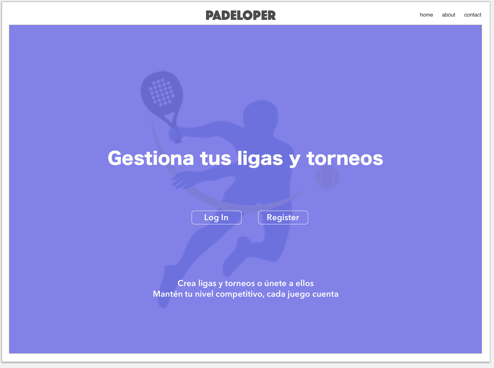
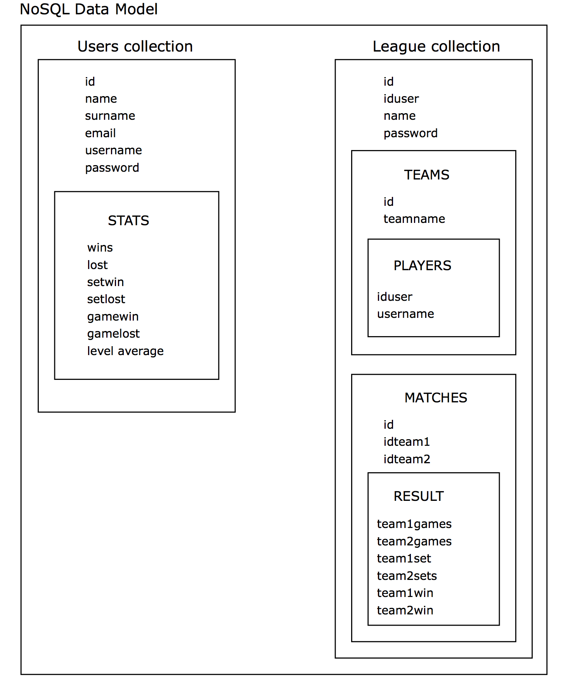
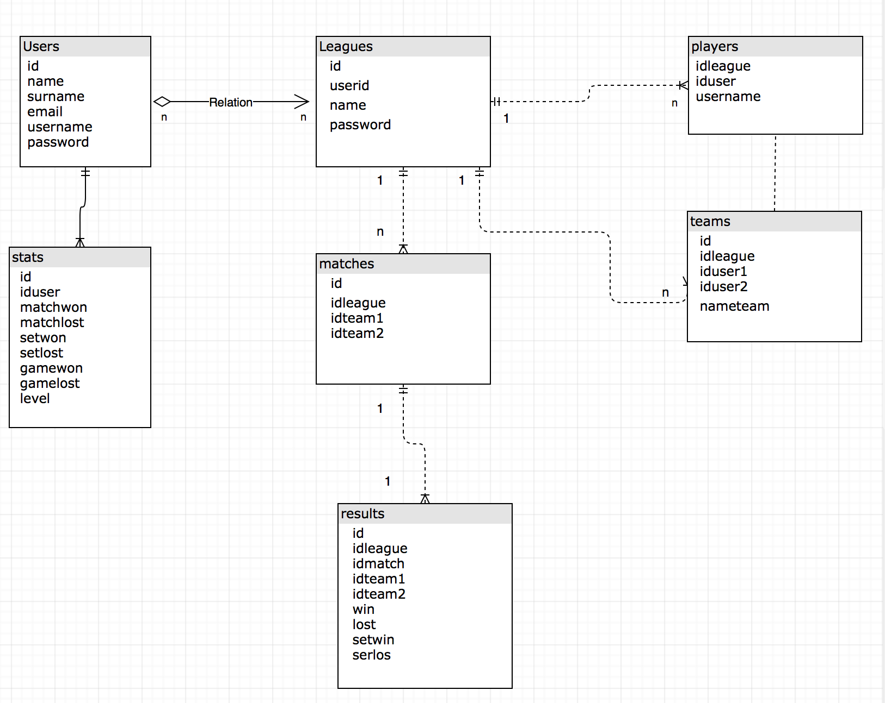

# Skylab Bootcamp: Proyecto Final

## Objetivo  
Crear un proyecto Full-Stack en tres semanas que englobe el uso de las tecnologías aprendidas en el bootcamp  

------------------

## Padeloper

Organizar ligas y torneos de padel puede convertirse en un quebradero de cabeza, tiempo, esfuerzo... Deja de preocuparte!!

Padeloper es una aplicación web para gestionar ligas y torneos de padel así como controlar el nivel competitivo de los usuarios. La finalidad de la misma es facilitar a los clubs la organización de ligas y torneos así como equilibrar el nivel de los partidos de manera que los usuarios puedan disputar partidas igualadas y disponer de un sitio web donde consultar sus estadísticas.

## Mockup

 
 [user-panel-index](design/mockups/user-panel-index.png)
 [user-panel-players](design/mockups/user-panel-players.png)
 [user-panel-teams](design/mockups/user-panel-teams.png)
 [user-panel-matches](design/mockups/user-panel-matches.png)

## Modelo de datos

Representación esquemática del modelo de datos de la aplicación.

 
 
 Modelo de datos definido con mongoose

## Arquitectura de la aplicación

Representación esquemática de la arquitectura de la aplicación

## Funcionamiento (liga)

- Usuarios se registran en la aplicación
- Cada usuario registrado puede crear o unirse a una liga. Si la crea tendrá permisos de administrador, si no sólo de jugador
- Una liga tendrá múltiples usuarios, con un límite.
- Los usuarios de la liga formarán equipos.
- Cada liga tendrá partidos según el número de equipos
- Cada partido tendrá resultados
- Según los resultados, clasificación y estadísticas.

## Estructura del proyecto

El proyecto constará de 3 directorios principales que funcionarán de manera independiente:
* app-client
* api-client
* api-server

### app-client

Para la parte de cliente se utilizará react, donde a través de handlers y componentes se realizarán las llamadas a la api-client
según se vaya necesitando. Para utilizar la api-client en react, la instalamos como package json con npm install api-client -- save.
Para ejecutar la parte de react nos colocamos en la carpeta raíz de app-client y realizamos 'yarn start', lo que lanzará la aplicación en el puerto 3000

### api-client

A través de la api client realizaremos todas las llamadas a la api server, apuntando a nivel local a localhost:5000/api. Se utilizará axios para efectuar todas las llamadas necesarias con get y post. Exportaremos la api client para poder utilizarla en react

### api-server

Para la realización de la api server utilizaremos express. Ésta api será la encargada de efectuar todas las operaciones de CRUD con la base de datos en los endpoints indicados. Para poner en marcha la api server y que la aplicación pueda trabajar nos colocamos en la carpeta raíz de api-server y realizamos 'node index'

------------------

## Enlaces de interés  

* Gestión de tareas en [Trello](https://trello.com/b/jZOWvkFg/padeloop)
* [Repositorio](https://github.com/nachomirsol/padeloper) del proyecto

## Tecnologías y recursos

* [HTML5](https://getbootstrap.com)
* [CSS3](https://getbootstrap.com)
* [Bootstrap](https://getbootstrap.com)
* [Jasmine JS](https://jasmine.github.io)
* [React](https://github.com/facebook/create-react-app)
* [node]()
* [express]()
* [MongoDb]()

## Planning

|    Fecha   |  Planificación  |
|------------|-----------------|
| 2018-03-09 | Explicar proyecto y planificar estrategia (trello y git) | 
| 2018-03-10 | Creación de mockups, modelo de datos y readme | 
| 2018-03-11 | Modelo de datos y estructurar html y css| 
| 2018-03-12 | Corregir modelo de datos y empezar maquetación html y css. UML | 
| 2018-03-13 | Crear modelo de datos con Mongoose y continuar maquetación html + css | 
| 2018-03-14 | Empezar Api server y crear proyecto en react, rutas express e intentar insertar datos desde postman| 
| 2018-03-15 | Pasar diseño a react con rutas frontend, corregir api server con test y data model de manu, react admin | 
| 2018-03-16 | Heroku demo y challenge, apuntar el proyecto a heroku y registrar usuarios|
| 2018-03-17 | Cambiar nombres de componentes y css para no solaparse, hacer en react toda la app y test de api-client| 
| 2018-03-18 | Terminar diseño en react y avanzar api-server, test e intentar separar en capas| 
| 2018-03-19 | Insertar players usuarios en ligas y eliminar, permisos según jugador o creador| 
| 2018-03-20 | Handlers errores y generar equipos random según players| 
| 2018-03-21 | Repaso handler errores y generación de equipos| 
| 2018-03-22 | Generar partidos y poder editar resultados| 
| 2018-03-23 | Repasae generar partidos y editar resultados, exposición 2| 
| 2018-03-24 | Retoques de todo | 